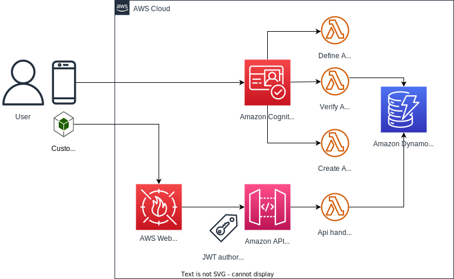
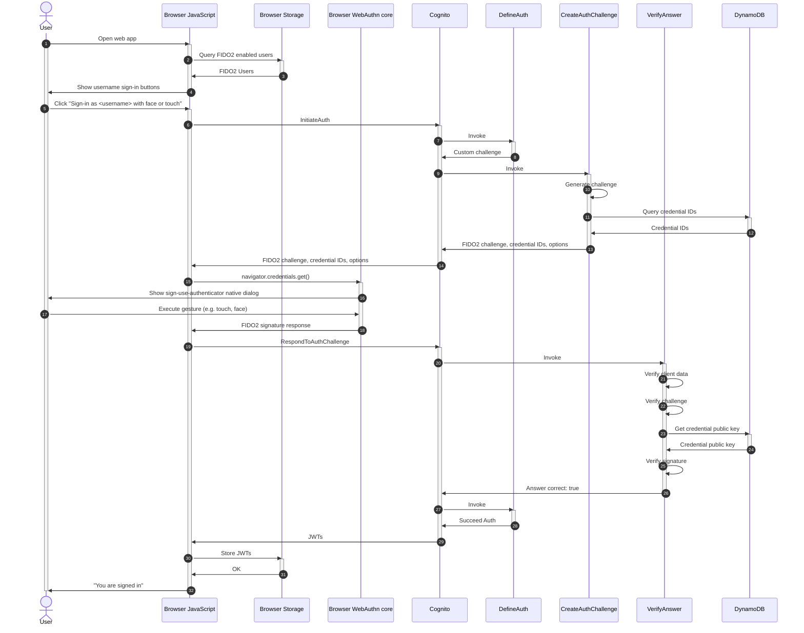
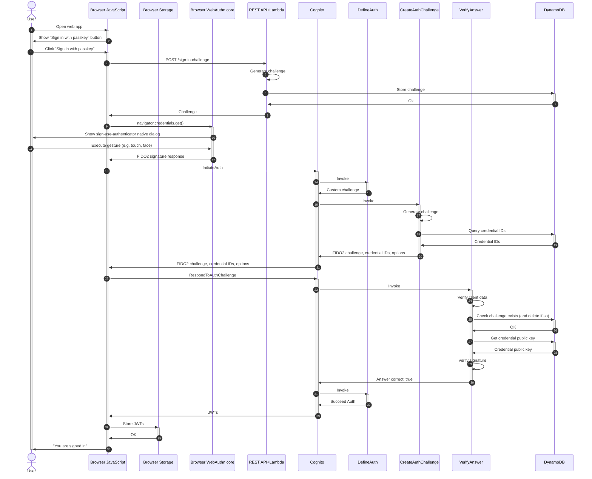

# FIDO2

This solution includes components that implement FIDO2 authentication, i.e. sign with Face, Touch, YubiKey, etc.:

- FIDO2 credentials are stored in an **Amazon DynamoDB** table, so that a virtual unlimited amount of credentials can be stored, with details such as: friendly name ("My iPhone"), last used date, how many times used, etc.
- **Amazon REST API** supports creating, updating and deleting FIDO2 credentials. This REST API is protected by a Cognito User Pools authorizer, meaning you must already be signed-in via different means (e.g, using Magic Link) to register a FIDO2 credential. Only the `sign-in-challenge` resource is public, to enable "usernameless" authentication, see below.
- **AWS Lambda functions** that implement the Amazon Cognito Custom Authentication flow, reading FIDO2 credential public keys from the DynamoDB table.
- Front End library functions, to work with this Custom Auth flow––can be used in Web, React, React Native.
- Pre-built sample React component to add/update/delete authenticators.

## Customizing Auth - e.g. to use custom FIDO2 challenges

If you want to do customization of this solution that goes beyond the parameters of the `Passwordless` construct, e.g. to use custom FIDO2 challenges, see [CUSTOMIZE-AUTH.md](./CUSTOMIZE-AUTH.md)

## FIDO2 Browser Support

FIDO2 (/WebAuthn) is still a relatively new standard and not all browsers support it to the fullest yet. Currently, we recommend to use Chrome, as it best supports FIDO2 in our experience.

Here are some issues in other browsers that we know of today:

- Mobile Safari on older iOS versions (seen on 16.0, no longer on 16.3) allows users to create multiple passkeys for the same username-website combination, whereby the older passkey is implicitly replaced by the newest. This can lead to confusion, as it's not possible for the FIDO2 backend of the solution here, to detect that the newer credential should replace the old one (as iOS did itself). Thus it simply stores the new credential without removing older ones. The user will then still see the older credentials in the credential list.
- Firefox support for WebAuthn is limited (seen on 102.8, said to be fixed in 109), e.g. doesn't support security keys with PIN, nor MacOS Touch.

## AWS Architecture

## Registering new FIDO2 Authenticators

First you must sign-in with a magic link (or any other means). After that you can register a FIDO2 capable authenticator to log in with next time.

## Sign-in with username

If we know the username (e.g. because the user typed it in, or we have it in app storage), we can immediately initiate sign in (via Custom Auth flow) with Amazon Cognito:

## Sign-in with passkey––without username (usernameless)

To initiate sign-in (via Custom Auth flow) with Amazon Cognito, we first need to establish the username. This works as follows:

1. We call the (public) API `/sign-in-challenge`
2. This returns a challenge, that we'll use with WebAuthn authentication (in `navigator.credentials.get()`). Note that in this case we don't pass an array of credential IDs to `navigator.credentials.get()`, because we wouldn't know them yet.
3. If the user has a Passkey (that is, a [discoverable credential](https://www.w3.org/TR/webauthn-2/#client-side-discoverable-public-key-credential-source)), the `navigator.credentials.get()` call will succeed. In its return value will be a `userHandle`, this will equal the username of the user in Amazon Cognito (in specific circumstances only––explanation below), so now we can initiate sign-in with Amazon Cognito similar as before.

### Note on `userHandle` and username

This solution supports usernameless FIDO2 authentication **only** if you use opaque usernames for your users in Amazon Cognito, i.e. UUIDs. This is because only in that case will we use the username as the WebAuthn credential [userHandle](https://www.w3.org/TR/webauthn-2/#user-handle). Reason: the `userHandle` must be opaque, and must not give away who the owning human being is. So, if you use readable usernames (e.g. `johndoe`), this solution won't use that as `userHandle` but uses the user's `sub` (a UUID generated by Amazon Cognito) instead––but you cannot initiate sign-in with the `sub` (if different from username).

There is also a design choice here: we could store a separate, self defined opaque `userHandle` always, but then we'd always have to map that `userHandle` to an actual username, before we can initiate sign-in with Amazon Cognito. If username is already opaque, we can use it as `userhandle` and the mapping `userHandle` to user is done implictly by Amazon Cognito.

Potential scenario's depending on your [User Pool's sign-in configuration](https://docs.aws.amazon.com/cognito/latest/developerguide/user-pool-settings-attributes.html#user-pool-settings-aliases):

- If you have configured your Amazon Cognito User Pool to **only** use e-mail and/or phone number to sign in with, then under the hood Amazon Cognito will generate an opaque username for you (same as `sub`) and usernameless authentication can work.
- If you have configured your Amazon Cognito User Pool to use e-mail and/or phone number to sign in with, but also allow an actual username (user or admin supplied), you must use a UUID as username––if so, usernameless authentication can work.
- If you have configured your Amazon Cognito User Pool to only use a username to sign in with, usernameless authentication cannot work (unless, a very unlikely scenario, users use UUIDs for their username).

See below how the usernameless authentication flow works. Notes:

- The WebAuthn interaction (`navigator.credentials.get()`) now takes place **before** invoking `InitiateAuth` with Amazon Cognito (in the flow with username it's after).
- The `CreateAuthChallenge` trigger will return a WebAuthn challenge also (it always does this if you've enabled FIDO2), but that challenge won't be used by the client (it already signed the challenge it got earlier from the `/sign-in-challenge` API endpoint).
- To add replay protection, the challenge that the API created and stored in DynamoDB, is removed from DynamoDB during verification of the challenge (atomic read+delete).

