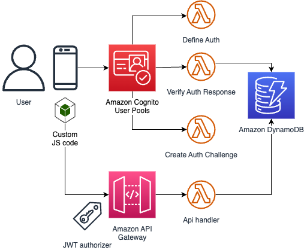
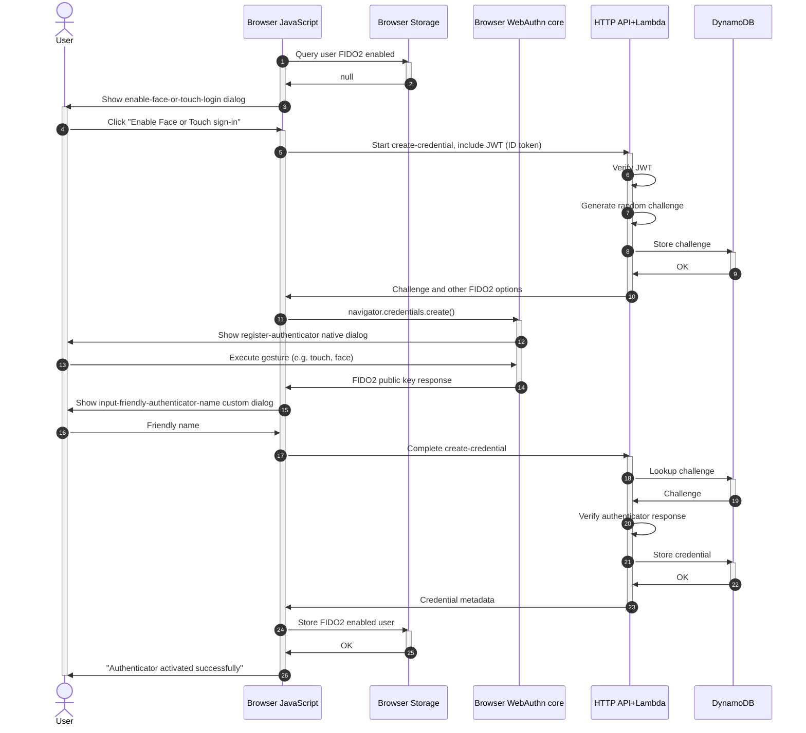
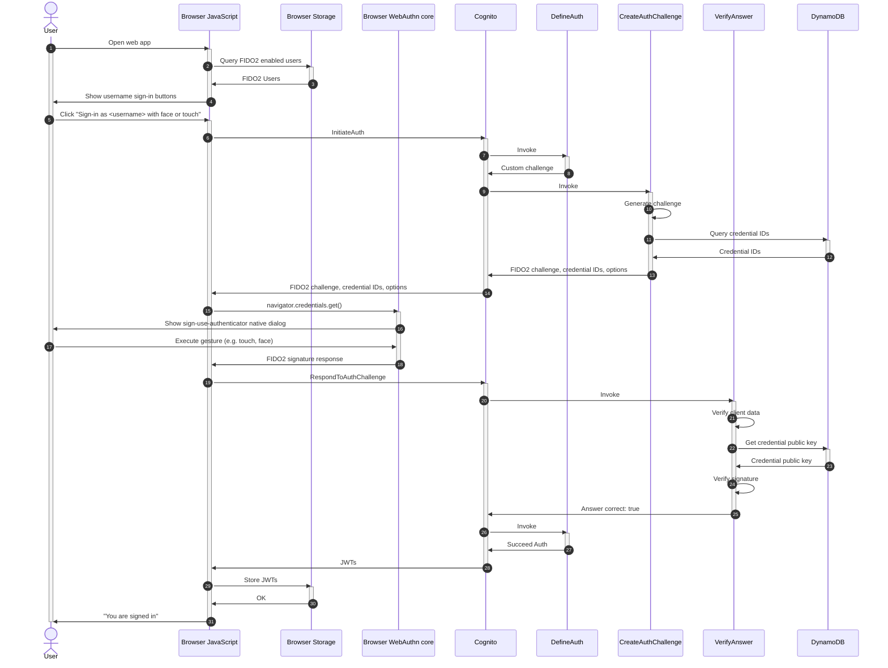

# FIDO2

This solution includes components that implement FIDO2 authentication, i.e. sign with Face, Touch, YubiKey, etc.:

- FIDO2 credentials are stored in an **Amazon DynamoDB** table, so that a virtual unlimited amount of credentials can be stored, with details such as: friendly name ("My iPhone"), last used date, how many times used, etc.
- **Amazon HTTP API** supports creating, updating and deleting FIDO2 credentials. This HTTP API is protected by a JWT authorizer, meaning you must already be signed-in via different means (e.g, using Magic Link) to register a FIDO2 credential.
- **AWS Lambda functions** that implement the Amazon Cognito Custom Authentication flow, reading FIDO2 credential public keys from the DynamoDB table.
- Front End library functions, to work with this Custom Auth flow––can be used in Web, React, React Native.
- Pre-built sample React component to add/update/delete authenticators.

## FIDO2 Browser Support

FIDO2 (/WebAuthn) is still a relatively new standard and not all browsers support it to the fullest yet. Currently, we recommend to use Chrome, as it best supports FIDO2 in our experience.

Here are some issues in other browsers that we know of today:

- Mobile Safari on older iOS versions (seen on 16.0, no longer on 16.3) allows users to create multiple passkeys for the same username-website combination, whereby the older passkey is implicitly replaced by the newest. This can lead to confusion, as it's not possible for the FIDO2 backend of the solution here, to detect that the newer credential should replace the old one (as iOS did itself). Thus it simply stores the new credential without removing older ones. The user will then still see the older credentials in the credential list.
- Firefox support for WebAuthn is limited (seen on 102.8, said to be fixed in 109), e.g. doesn't support security keys with PIN, nor MacOS Touch.

## AWS Architecture

## Registering new FIDO2 Authenticators

First you must sign-in with a magic link (or any other means). After that you can register a FIDO2 capable authenticator to log in with next time.

## Sign-in

