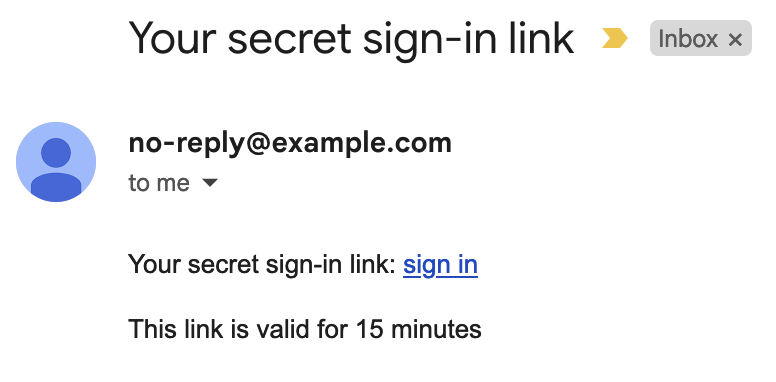
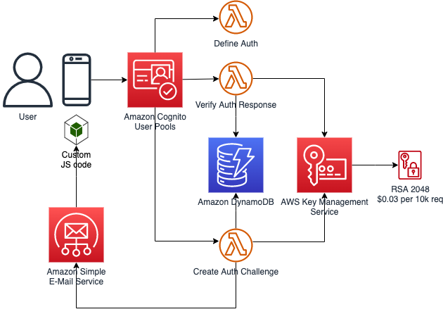
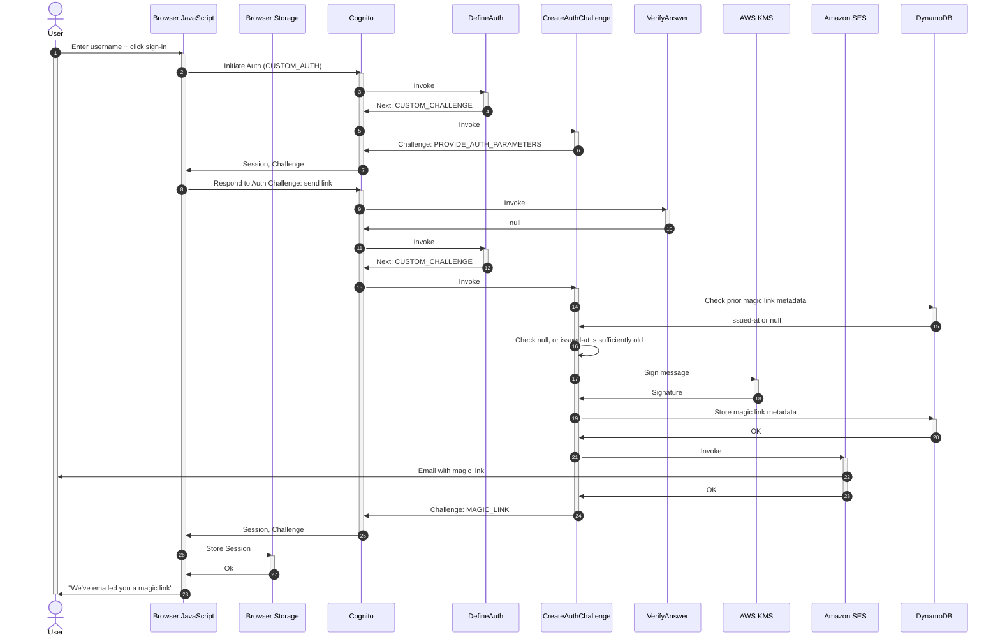
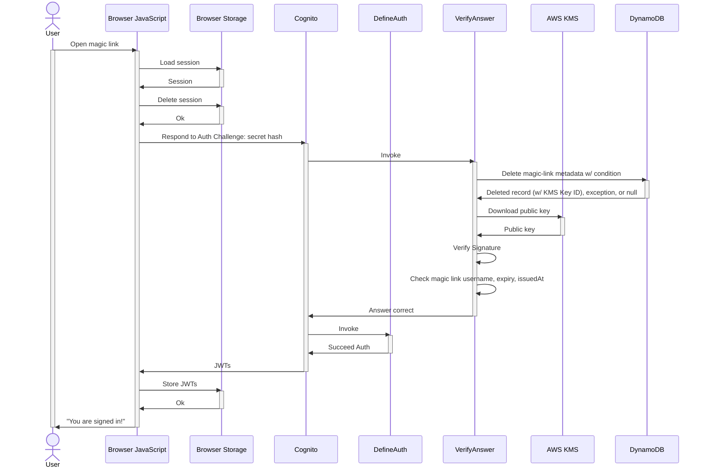
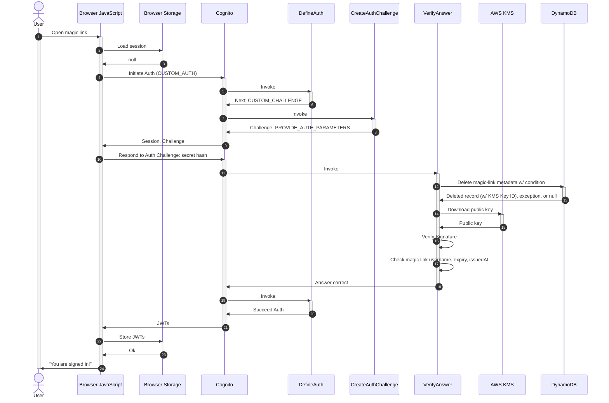

# Magic Links

This solution includes components to support signing-in with a Magic Link:

- **AWS Lambda functions** that implement the Amazon Cognito Custom Authentication flow, using **Amazon Simple E-Mail Service (SES)** to send the e-mails to users.
- For each Magic Link, cryptographic hashes are stored in an **Amazon DynamoDB** table, so that (1) we can ensure that a Magic Link can only be used once, (2) that a user can have maximally 1 unused Magic Link outstanding, and (3) that a user must wait minimally one minute before allowing him/her to request a new Magic Link. These cryptographic hashes cannot be traced to its corresponding user, except by our Lambda functions (who know the seed).
- Magic Links are signed using an **Amazon Key Management Service (KMS)** asymmetric key. Using AWS KMS (vs. storing and sending a cryptographically secure random string, i.e. an email-based OTP) allows us to store only non-sensitive data in DynamoDB, so access to the DynamoDB table doesn't allow signing in as specific users by taking OTPs from the table.
- Front End library functions, to work with this Custom Auth flow––can be used in Web, React, React Native.

## Customizing Auth - e.g. to use your own e-mail template

If you want to do customization of this solution that goes beyond the parameters of the `Passwordless` construct, e.g. to use your own e-mail content for magic links, see [CUSTOMIZE-AUTH.md](./CUSTOMIZE-AUTH.md)

## AWS Architecture

## Request Magic Link

## Complete Sign-in: same browser, new tab

## Complete Sign-in: different browser

