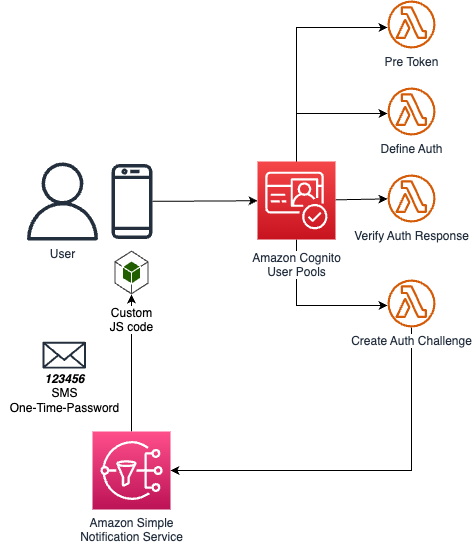

# SMS One Time Password (OTP) Step Up Authentication

This solution includes components to support step-up auth, using SMS One-Time-Password (OTP):

- **AWS Lambda functions** that implement the Amazon Cognito Custom Authentication flow, using **Amazon Simple Notification Service (SNS)** to send the SMS-es with a One-Time-Password (OTP) to users.
- The library [aws-jwt-verify](https://github.com/awslabs/aws-jwt-verify) is used to verify it is indeed a step-up case, i.e. the user must posses valid JWTs already.
- Front End library functions, to work with this Custom Auth flow––can be used in Web, React, React Native.

## Customizing Auth - e.g. to use your own SMS template

If you want to do customization of this solution that goes beyond the parameters of the `Passwordless` construct, e.g. to use your own SMS template, see [CUSTOMIZE-AUTH.md](./CUSTOMIZE-AUTH.md)

## AWS Architecture

## Step-up Authentication with SMS One-Time-Password

First, you must sign-in via another sign-in method (e.g. Magic Link). Then you can step-up auth: sign-in again with a SMS One-Time-Password (OTP).

In order to prove to the back-end server that this is indeed a Step-Up auth we recommend a procedure such as the following.

### Sample Procedure

Architect the interaction with the backend, such that it is 2-legged. For example, let's consider a user wanting to do a banking transaction. This could then work as follows:

- **First leg**: the user's client calls the backend, to initiate the transaction. The backend doesn't execute the transaction yet but only returns a unique transaction ID that it generated randomly
- The user's client then initiates the SMS OTP Step Up auth (initiateAuth). A custom authentication starts, in which an OTP is generated and sent to the user via SMS
- The user submits the received OTP to the client
- The user's client sends the received OTP as well as it's current valid JWT to Amazon Cognito (respondToAuthChallenge), and provides the transaction ID as part of the `clientMetadata` to Amazon Cognito
- The Verify Auth trigger verifies the OTP as well as the JWT (proving this is an auth step-up, as you must have a valid JWT already to pass this)
- You have configured the Amazon Cognito pre-token trigger to add the transaction ID from the `clientMetadata` as a claim to the JWT
- **Second leg**: the user's client calls the backend again to confirm the transaction, with the new JWT, that now has the transaction ID as a claim.
- The backend verifies the JWT and the transaction ID claim. The backend can now deduce that indeed the user was able to prove their identity again: the user stepped-up auth in context of the transaction ID concerned. The backend can now proceed with executing the transaction (or do any other checks it deems necessary).

