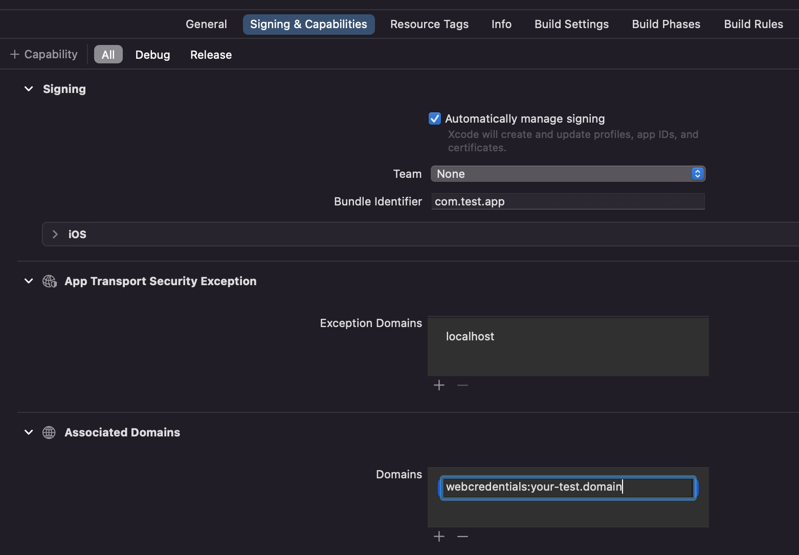

# Amazon Cognito Passwordless Auth - React Native client

> **_NOTE:_** This page describes the React Native specific features of this library. You can of course also use the [generic JavaScript](../README.md) features in React Native, but note that imports must be done differently in React Native: see [Usage](#5.-usage).

Upon deploying the backend (with the `Passwordless` CDK construct), custom authentication flows are added to your Amazon Cognito User Pool, and your front-end will need to initiate and "dance" along in the Passwordless choreography to sign users in. This library provides a hook to make that easy in React Native: the `usePasswordless` provides all functionality to sign-in with FIDO2 or SMS Step Up Auth (and passwords too should you want it).

For React Native this library does not include prebuilt UI components, so you have to build your own sign-in page. It should be relatively easy to do that as the `usePasswordless` hook will do the heavy lifting for you. This is the same hook that is also available in React: refer to the [React docs](./README-REACT.md) to understand how to use the `usePasswordless` hook.

Note that in React Native, these sign-in method are not (yet) available:

- Magic Links
- Username password auth with Secure Remote Password (SRP). Only username password auth with plaintext password is supported on React Native.

### Table of Contents

1. [Considerations](#1.-considerations)
2. [Pre-requisites](#2.-pre-requisites)
3. [Installation](#3.-installation)
4. [iOS Setup](#4.-ios-setup)
5. [Usage](#5.-usage)

---

#### 1. Considerations

- This library supports RN 70.6+ and to be able to use it, you must have your [environment properly setup for react native](https://reactnative.dev/docs/environment-setup).
- For React Native this library does not include prebuilt UI components. You can implement those yourself within your app and you can use the hooks of this library (`usePasswordless`) to do much heavy lifting, as documented in this README.
- Passkeys are natively supported only on iOS so far (although they'll be available for [Android very soon](https://developers.google.com/identity/passkeys/faq))
- iOS Target must be 16.0+ since passkeys are not available in older versions
- In order to use passkeys in iOS, you need to enable associated domains and, therefore, you'll need a [Paid Apple Developer Subscription](https://developer.apple.com/support/compare-memberships/) to use it.

#### 2. Pre-requisites

- Make sure you have properly setup the library and deployed all required backend dependencies. [More info](../../README.md)
- Mandatory peer dependency: [react-native-passkey](https://github.com/f-23/react-native-passkey) that interacts with the native components to use passkeys
- Mandatory peer dependency: [React Native Async Storage](https://react-native-async-storage.github.io/async-storage/docs/install/) to save the state of the auth session

### 3. Installation

This library is published as a npm package under `amazon-cognito-passwordless-auth` name. Install it by running the following command:

```shell
npm install amazon-cognito-passwordless-auth
```

For usage in React Native, make sure to also install `react-native-passkey`:

```shell
npm install react-native-passkey@^2.1.1
```

#### 4. iOS Setup

To use it in iOS you need to setup your associated domain and serve the config JSON file required for Apple from it.

##### Setting Up the associated domain

1. Open your project's XCode Workspace by navigating to the root folder of your React Native App and run `open ./ios/YOUR_APP_NAME.xcworkspace`
2. Select your target App and navigate to `Signing & Capabilities` tab
3. Scroll down until you find the `Associated Domains` section and click the button `+` to add one
4. Type `webcredentials:` followed by your naked domain (e.g.: `webcredentials:example.com`)



##### Serving the static JSON config file

Now you just need to serve the following config file under a `GET https://<yourdomain>/.well-known/apple-app-site-association`:

```json
{
  "applinks": {},
  "webcredentials": {
    "apps": ["<YOUR_TEAM_IDENTIFIER>.<YOUR_APP_BUNDLE_ID>"]
  },
  "appclips": {}
}
```

Just replace `<YOUR_TEAM_IDENTIFIER>` for your Apple Team identifier and `<YOUR_APP_BUNDLE_ID>` for the bundle id you setup for your app.

For example if your team ID is `H123456789` and your bundle `com.example.app`, you should serve the following file:

```json
{
  "applinks": {},
  "webcredentials": {
    "apps": ["H123456789.com.example.app"]
  },
  "appclips": {}
}
```

#### 5. Usage

To use the library, you need to first import, wrap your app with the PasswordlesContextProvider and configure it, usually in your main App.js.

##### Configuration

```javascript
import AsyncStorage from "@react-native-async-storage/async-storage";
import {
  PasswordlessContextProvider,
  Passwordless,
} from "amazon-cognito-passwordless-auth"; // In React Native: import from top-level module

function App() {
  Passwordless.configure({
    cognitoIdpEndpoint: "eu-west-1", // you can also use the full endpoint URL, potentially to use a proxy
    clientId: "<client id>",
    // optional, only required if you want to use FIDO2:
    fido2: {
      baseUrl: "<fido2 base url>",
      /**
       * React Native Passkey Domain. Used by iOS and Android to link your app's passkeys to your domain
       * That domain must serve the mandatory manifest json required by Apple and Google under the following paths:
       * - iOS: https://<your_passkey_domain>/.well-known/apple-app-site-association
       * - Android: https://<your_passkey_domain>/.well-known/assetlinks.json
       * More info:
       * - iOS: https://developer.apple.com/documentation/xcode/supporting-associated-domains
       * - Android: https://developer.android.com/training/sign-in/passkeys#add-support-dal
       */
      passkeyDomain: "<ASSOCIATED_PASSKEY_DOMAIN>",
      /**
       * Configure Relying Party ID
       */
      rp: {
        id: "example.com", // default: your passkeyDomain
        name: "Example.com", // default: your passkeyDomain
      },
    },
    userPoolId: "<user pool id>", // optional, only required if you want to use USER_SRP_AUTH
    // optional, additional headers that will be sent with each request to Cognito:
    proxyApiHeaders: {
      "<header 1>": "<value 1>",
      "<header 2>": "<value 2>",
    },
    storage: AsyncStorage, // Need to set this for React Native, as the default (localStorage) will not work
  });
  // Your original App here
}

export default function AppWrapped() {
  return (
    <PasswordlessContextProvider>
      <App />
    </PasswordlessContextProvider>
  );
}
```

Then, in your components, use the `usePasswordless` hook:

```javascript
import {
  signUp,
  usePasswordless,
} from 'amazon-cognito-passwordless-auth'; // In React Native: import from top-level module

export default function YourComponent() {
  const {
    authenticateWithPlaintextPassword
  } = usePasswordless();

  async function signUp() {
    await signUp({
      username: 'YOUR_USER_NAME',
      password: 'YOUR_PREFERRED_PASSWORD',
      /* BELOW PARAMETERS ARE OPTIONAL */
      userAttributes: [
        {
          name: 'name',
          value: 'YOUR NAME'
        }
      ]
    });
    // userAttributes are optional and you can pass any Cognito User pool attributes
    // Read more: https://docs.aws.amazon.com/cognito/latest/developerguide/user-pool-settings-attributes.html
  }

  async function logIn() {
    // MagicLink and SRP Authentication is not yet supported for React Native
    await authenticateWithPlainTextPassword({
      username: 'YOUR_USER_NAME',
      password: 'YOUR_PREFERRED_PASSWORD',
    });
  }

  return (
    // Your component's view
  );
}
```

Refer to the [React docs](./README-REACT.md) for further explanations on the `usePasswordless` hook.
