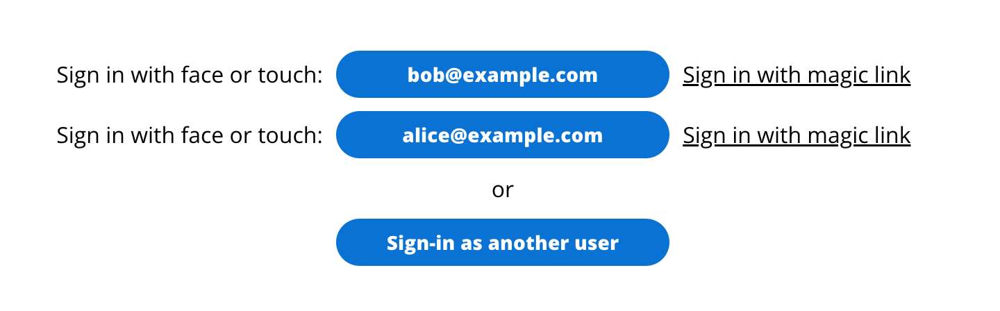
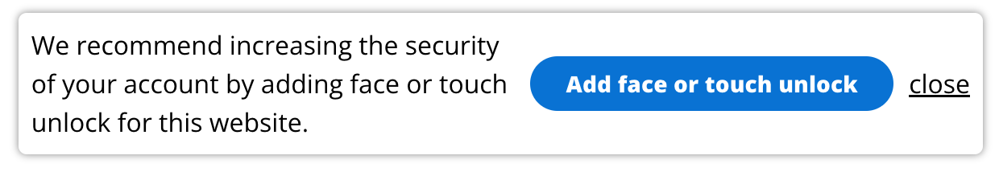
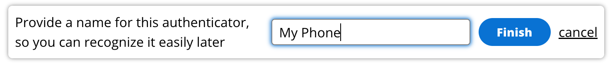
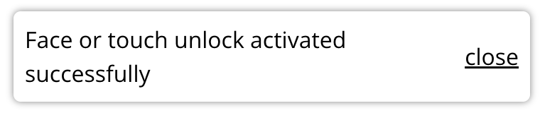

# Amazon Cognito Passwordless Auth - React client

> **_NOTE:_** This page describes the React specific features of this library. You can of course also use the [generic JavaScript](../README.md) features in React.

Upon deploying the backend (with the `Passwordless` CDK construct), custom authentication flows are added to your Amazon Cognito User Pool, and your front-end will need to initiate and "dance" along in the Passwordless choreography to sign users in. This library provides a hook and sample components to make that easy:

- React hook: `usePasswordless`: this hook provides all functionality to sign-in with Magic Links, FIDO2, SMS Step Up Auth (and passwords too should you want it).
- Sample React components––to get started quickly and for inspiration to build your own:
  - `<Passwordless />`: sample component that renders a login page, allowing the user to choose between FIDO2 and Magic Links
  - `<Fido2Toast />`: sample component (a "toast" at the top of the page) that (1) recommends to add a FIDO2 credential if the user doesn't yet have one and (2) shows the user's registered FIDO2 credentials

A good way to see it in action and play around is to deploy the [end-to-end example](../../end-to-end-example) into your own AWS account. You can run the accompanying front end locally, and sign-in with magic links and FIDO2, and SMS OTP Step Up Authentication.

## `usePasswordless` hook

This hook uses React context. To use this hook, wrap your components with the `PasswordlessContextProvider`: see [Configuration](#configuration).

```jsx
import { usePasswordless } from "amazon-cognito-passwordless-auth/react";

const {
  /** Magic links */
  requestSignInLink, // function to request a sign-in link ("magic link") to be sent to the user's e-mail address

  /** FIDO2 */
  authenticateWithFido2, // function to sign in with FIDO2 (e.g. Face ID or Touch)
  fido2CreateCredential, // function to register a new FIDO2 credential with the Relying Party
  creatingCredential, // boolean, set to true during creation of a FIDO2 credential
  fido2Credentials, // array of the user's registered FIDO2 credentials. Each credential provides `update` and `delete` methods
  userVerifyingPlatformAuthenticatorAvailable, // boolean, set to true if a user verifying platform authenticator is available (e.g. Face ID or Touch ID)
  showAuthenticatorManager, // boolean, set to true if the FIDO2 credential manager UI component should be shown (the Fido2Toast component use this to show/hide itself)
  toggleShowAuthenticatorManager, // function to toggle the showAuthenticatorManager boolean

  /** Username Password */
  authenticateWithSRP, // function to sign in with username and password (using SRP: Secure Remote Password, where the password isn't sent over the wire)
  authenticateWithPlaintextPassword, // function to sign in with username and password (the password is sent in plaintext over the wire, instead use authenticateWithSRP if you can)

  /** SMS OTP Step Up */
  stepUpAuthenticationWithSmsOtp, // function to sign in with the user's current tokens (JWTs) and an OTP (One Time Password) that is sent to the user via SMS

  /** JWTs */
  tokens, // raw (i.e. string) JWTs of the signed-in user: ID token, Access token and Refresh Token
  tokensParsed, // JSON parsed ID and Access token of the signed-in user. Use this e.g. to access the user's attributes, such as e-mail, name (on the ID token)

  /** Refresh JWTs */
  refreshTokens, // function to force token refresh (it will happen automatically, but there's reasons to want to force it, e.g. if the user's attributes changed and you want this to be reflected in the ID token)
  isRefreshingTokens, // boolean, set to true during token refresh

  /** Errors */
  lastError, // contains the last error that occured in the authentication flow (if any)

  /** Status */
  signInStatus, // overall auth status, e.g. is the user signed in or not? Use this field to show the relevant UI, e.g. render a sign-in page, if the status equals "NOT_SIGNED_IN"
  signingInStatus, // status of the most recent sign-in attempt, e.g. "REQUESTING_SIGNIN_LINK", or "STARTING_SIGN_IN_WITH_FIDO2"
  busy, // boolean, set to true during sign-in and sign-out (e.g. use this if you want to display a spinner)

  /** Sign out */
  signOut, // function to sign out (remove JWTs from storage, revoke tokens at Cognito)
} = usePasswordless();
```

See more details below.

## `<Passwordless />` sample component

A prefab sample login component, that supports signing in with FIDO2 and Magic Links. Shows the last user that was signed in on this device, so that they may sign-in again without having to enter their username:



Users can also sign in with their Passkey, without typing in their username:


You should wrap your own in app in this component (as child). The component will render your app (the child), instead of itself, once the user successfully signs in:

```jsx
<Passwordless>
  <App />
</Passwordless>
```

If you don't wrap a child in this component (i.e. just have it as `<Passwordless />`) and the user is signed in, it will render itself as a debug utility:


## `<Fido2Toast />` sample component

This component, that renders as a "toast" at the top right corner of the viewport, has two purposes:

1. Recommend the user to create a FIDO2 credential if the user doesn't have one yet.
2. Show the list of registered FIDO2 credentials, allowing the user the delete, update, and add new ones.

Add the `<Fido2Toast />` at the top level of your app, below other components so it can render on top without needing `z-index` or other tricks. See [Configuration](#configuration).

### Recommendation to create a FIDO2 credential

The recommendation appears automatically on the top right of the page, if the user signed-in using another method than FIDO2, doesn't yet have any FIDO2 credentials set up, and has a user verifying platform authenticator available:



If the user clicks "Add face or touch unlock", registration starts. The user will have to perform the gesture (Face/Touch) and is then asked to provide a friendly name for the FIDO2 credential:



If all went well, FIDO2 is activated. Next time, the user can sign in with FIDO2!:



### Manage FIDO2 credentials

The FIDO2 credentials manager appears on the top right of the page, if you call `toggleShowAuthenticatorManager()` (function made available by the `usePasswordless` hook).


<br />

---

## Table of Contents

1. [Considerations](#1.-considerations)
2. [Pre-requisites](#2.-pre-requisites)
3. [Installation](#3.-installation)
4. [Usage](#4.-usage)

---

### 1. Considerations

- This library supports React 17.0+ and to be able to use it, you must have your [environment properly setup for react](https://reactjs.org/docs/getting-started.html).
- As the time of writing, WebAuthn is natively supported on Chrome, Firefox, Microsoft Edge and Safari. However, browsers differ in their level of support (see also [fido2-browser-support](../../FIDO2.md#fido2-browser-support)).

### 2. Pre-requisites

- Make sure you have properly setup the library and deployed all required backend dependencies. [More info](../../README.md)
- Mandatory peer dependency: [react](https://github.com/facebook/react)

### 3. Installation

This library is published as a npm package under `amazon-cognito-passwordless-auth` name. Install it by running the following command:

```
npm install amazon-cognito-passwordless-auth
```

### 4. Usage

A great way to learn how to use this library is to look at how we use it ourselves in the end-to-end example: [end-to-end-example/client](../../end-to-end-example/client)

- In [main.tsx](../../end-to-end-example/client/src/main.tsx) we configure the library and wrap our own app with the `PasswordlesContextProvider` as well as with the `Passwordless` component. Also we add the `<Fido2Toast />` container, to display the [FIDO2 "toast"](#fido2toast--component).
- In [App.tsx](../../end-to-end-example/client/src/App.tsx) we use the `usePasswordless` hook to understand the user's sign-in status, provide a button to sign out, and toggle show/hide the authenticators manager (part of the [FIDO2 "toast"](#fido2toast--component)).
- In [StepUpAuth.tsx](../../end-to-end-example/client/src/StepUpAuth.tsx) we show how to execute SMS OTP Step Up Authentication.

#### Configuration

To use the library, you need to first import and configure it, and then wrap your app with the `PasswordlesContextProvider`.

In your web app's entrypoint (e.g. `main.tsx`)

```javascript
import { Passwordless } from "amazon-cognito-passwordless-auth/react";

Passwordless.configure({
  cognitoIdpEndpoint: "eu-west-1", // you can also use the full endpoint URL, potentially to use a proxy
  clientId: "<client id>",
  // optional, only required if you want to use FIDO2:
  fido2: {
    baseUrl: "<fido2 base url>",
    /**
     * all other FIDO2 config is optional, values below are examples only to illustrate what you might configure.
     * (this client side config is essentially an override, that's merged on top of the config received from the backend)
     */
    authenticatorSelection: {
      userVerification: "required",
      requireResidentKey: true,
      residentKey: "preferred",
      authenticatorAttachment: "platform",
    },
    rp: {
      id: "example.com",
      name: "Example",
    },
    attestation: "direct",
    extensions: {
      appid: "u2f.example.com",
      credProps: true,
      hmacCreateSecret: true,
    },
    timeout: 120000,
  },
  userPoolId: "<user pool id>", // optional, only required if you want to use USER_SRP_AUTH
  // optional, additional headers that will be sent with each request to Cognito:
  proxyApiHeaders: {
    "<header 1>": "<value 1>",
    "<header 2>": "<value 2>",
  },
  storage: localStorage, // Optional, default to localStorage
});
```

Then, wrap your app with the `PasswordlessContextProvider`:

```typescript
import { PasswordlessContextProvider } from "amazon-cognito-passwordless-auth/react";

ReactDOM.createRoot(document.getElementById("root")).render(
  <PasswordlessContextProvider>
    <React.StrictMode>
      <App />
    </React.StrictMode>
  </PasswordlessContextProvider>
);
```

Note: React context is used to make sure authentication actions, such as trading the magic link hash for JWTs, happen only once––even though multiple components may use the `usePasswordless` hook in parallel.

You can also wrap your app with the `Passwordless` component. In that case, your app will only show if the user is signed in, otherwise the `Passwordless` component shows to make the user sign in. If you're using the sample components, also include the CSS import:

```typescript
import {
  PasswordlessContextProvider,
  Passwordless as PasswordlessComponent,
} from "amazon-cognito-passwordless-auth/react";
import "amazon-cognito-passwordless-auth/passwordless.css";

ReactDOM.createRoot(document.getElementById("root")).render(
  <PasswordlessContextProvider>
    <PasswordlessComponent
      brand={{
        backgroundImageUrl: "<url>",
        customerName: "ACME corp.",
        customerLogoUrl: "<url>",
      }}
    >
      <React.StrictMode>
        <App />
      </React.StrictMode>
    </PasswordlessComponent>
  </PasswordlessContextProvider>
);
```

If you want to make the `Passwordless` component bigger or smaller, e.g. the size of the entire page, override the height and width of the `.passwordless-main-container` class in your own CSS definitions. For example:

```
.passwordless-main-container {
  height: 100vh !important;
}
```

Also, add the [FIDO2 "toast"](#fido2toast-component) to display the suggestion to enable FaceID/TouchID, and be able to show the authenticators manager. Here's a complete example doing that:

```typescript
import {
  PasswordlessContextProvider,
  Passwordless as PasswordlessComponent,
  Fido2Toast,
} from "amazon-cognito-passwordless-auth/react";
import "amazon-cognito-passwordless-auth/passwordless.css";

ReactDOM.createRoot(document.getElementById("root")).render(
  <PasswordlessContextProvider>
    <PasswordlessComponent
      brand={{
        backgroundImageUrl: "<url>",
        customerName: "ACME corp.",
        customerLogoUrl: "<url>",
      }}
    >
      <React.StrictMode>
        <App />
      </React.StrictMode>
    </PasswordlessComponent>
    <Fido2Toast />
  </PasswordlessContextProvider>
);
```

In your components, use the `usePasswordless` hook:

```typescript
import { usePasswordless } from "amazon-cognito-passwordless-auth/react";

function MyComponent() {
  const { signInStatus, ... } = usePasswordless();

  return <div>Your sign in status: {signInStatus}</div>;
}
```

#### Sign In with Magic Link

Signing in with a magic link works in 2 steps (see also: [MAGIC-LINKS](../../MAGIC-LINKS.md)):

##### 1. Request Magic Link

Your web app requests a magic link to be e-mailed to the user. Let's assume your web app runs at `https://www.example.org`. The Amazon Cognito User Pool (through custom authentication triggers) will then create a magic link such as `https://www.example.org#eyJ1c2VyTmFtZSI6...` and e-mail that to the user.

##### 2. Open Magic Link

The user opens their e-mail client and clicks on the magic link. This will open e.g. `https://www.example.org#eyJ1c2VyTmFtZSI6...` in a new browser tab, where your web app will initialize. Since you wrapped your app with the `PasswordlessContextProvider`, this passwordless library will initialize, check the browser's location, find the magic link there, and use it to complete the sign-in process to get JWTs from the Cognito User pool (you could say, the magic link is traded agains JWTs). After that the user is signed-in, and the JWTs will be stored in your configured storage (`localStorage` by default).

All this happens automatically when your web app initializes, because you've wrapped it with the `PasswordlessContextProvider`. If you're building a custom sign in page (i.e. if you're not using the prefab `Passwordless` component), the only thing you have to code yourself is the requesting of a magic link:

```javascript
import { usePasswordless } from "amazon-cognito-passwordless-auth";

export default function YourComponent() {
  const { requestSignInLink } = usePasswordless();

  <form
    onSubmit={(event) => {
      // Request a magic link to be e-mailed to the user.
      // When the user clicks on the link, your web app will open and parse the link
      // automatically (if you've loaded this library), and sign the user in.
      // Supply an optional redirectUri as the second argument to specify where
      // in your application you'd like the user to be directed to after signing in.
      requestSignInLink({
        username: event.currentTarget.username.value,
        redirectUri: "https://example.com/article/45",
      });
      event.preventDefault();
    }}
  >
    <input type="text" placeholder="Username" name="username" />
    <input type="submit" value="Request magic link" />
  </form>;
}
```

#### Token (JWT) Storage

The library automatically saves the JWTs (id token, access token, refresh token) in your configured storage (default: `localStorage`) so that now you can use the rest of the methods and it will remember the logged user and will perform all requests against it.

To access them, use the `usePasswordless()` hook as follows:

```javascript
const {
  tokens, // the raw tokens, i.e. ID, Access, Refresh token as strings
  tokensParsed, // the JSON parsed tokens
} = usePasswordless();
```

#### Create FIDO2 Credential

Once you are signed in, you can create FIDO2 (WebAuthn) credentials for your user, this will prompt the native WebAuthn dialog (e.g. Face/Touch) on your environment and set it up for your cognito user.

```javascript
import { usePasswordless } from "amazon-cognito-passwordless-auth/react";

export default function YourComponent() {
  const { fido2CreateCredential } = usePasswordless();

  return (
    <form
      onSubmit={(event) => {
        fido2CreateCredential({
          friendlyName: event.currentTarget.friendlyName.value,
        }).then((credential) => {
          //  The credential object will look like this:
          //  credential = {
          //    credentialId: string;
          //    friendlyName: string;
          //    createdAt: Date;
          //    lastSignIn?: Date;
          //    signCount: number;
          //    update: (friendlyName: string) => void; // function to update the friendlyName
          //    delete: () => void; // function to delete the credential
          //    busy: boolean; // set to true if the credential is being updated or deleted
          //  }
          console.log(credential);
        });
        event.preventDefault();
      }}
    >
      <input type="text" placeholder="Device name" name="friendlyName" />
      <input type="submit" value="Create new FIDO2 credential" />
    </form>
  );
}
```

This will prompt the native WebAuthn dialog (e.g. Face/Touch) on your environment to create the credential.

#### LogIn with your FIDO2 Credential

If the user has registered FIDO2 credentials, use the `authenticateWithFido2()` function to let the user sign-in with them.

```javascript
import { usePasswordless } from "amazon-cognito-passwordless-auth/react";

export default function YourComponent() {
  const { authenticateWithFido2 } = usePasswordless();

  return (
    <form
      onSubmit={(event) => {
        authenticateWithFido2({
          username: event.currentTarget.username.value,
        });
        event.preventDefault();
      }}
    >
      <input type="text" placeholder="Username" name="username" />
      <input type="submit" value="Authenticate with FIDO2" />
    </form>
  );
}
```

This will prompt the native WebAuthn dialog (e.g. Face/Touch) on your environment to perform the log in.

#### Sign In with Password

Sure you can still use passwords if you really want to :)

```javascript
import { usePasswordless } from "amazon-cognito-passwordless-auth";

export default function YourComponent() {
  const { authenticateWithSRP, authenticateWithPlaintextPassword } =
    usePasswordless();

  // Sample form that allows the user to sign up
  return (
    <form
      onSubmit={(event) => {
        if (event.currentTarget.srp) {
          authenticateWithSRP({
            username: event.currentTarget.username.value
            password: event.currentTarget.password.value
          });
        } else {
          authenticateWithPlaintextPassword({
            username: event.currentTarget.username.value
            password: event.currentTarget.password.value
          });
        }
        event.preventDefault();
      }}
    >
      <input type="text" placeholder="Username" name="username" />
      <input type="password" placeholder="Password" name="password" />
      <input type="checkbox" name="srp" checked>Use Secure Remote Password (SRP)</input>
      <input type="submit" value="Authenticate with username and password" />
    </form>
  );
}
```

#### SignOut

To delete the stored tokens (JWTs), and revoke the refresh token, use the `signOut()` function.

```javascript
import { usePasswordless } from "amazon-cognito-passwordless-auth/react";

export default function YourComponent() {
  const { signOut } = usePasswordless();

  return <button onClick={() => signOut()}>Sign out</button>;
}
```

#### Refresh JWTs

The library automatically refreshes your tokens so you normally don't have to worry about this yourself. To force a refresh, use `refreshTokens()` function.

```javascript
import { usePasswordless } from "amazon-cognito-passwordless-auth/react";

export default function YourComponent() {
  const { refreshTokens } = usePasswordless();

  return <button onClick={() => refreshTokens()}>Refresh tokens!</button>;
}
```

#### List FIDO2 Credentials

The list of FIDO2 credentials is made available via the hook:

```javascript
import { usePasswordless } from "amazon-cognito-passwordless-auth/react";

export default function YourComponent() {
  // Credentials will be fetched when the app loads, initially fido2Credentials will be undefined
  const { fido2Credentials } = usePasswordless();
  // After credentials have been fetched, fido2Credentials will be an array of credentials.
  // Each credential object in the array will look like this:
  // credential = {
  //   credentialId: string;
  //   friendlyName: string;
  //   createdAt: Date;
  //   lastSignIn?: Date;
  //   signCount: number;
  //   update: (friendlyName: string) => void; // function to update the friendlyName
  //   delete: () => void; // function to delete the credential
  //   busy: boolean; // set to true if the credential is being updated or deleted
  // }

  return (
    // Your component's view
    <div>
      {fido2Credentials === undefined
        ? "Loading FIDO2 credentials ..."
        : `You have ${fido2Credentials.length} registered credentials`}
    </div>
  );
}
```

#### Delete FIDO2 Credential

Each FIDO2 Credential exposes a `delete()` method:

```javascript
import { usePasswordless } from "amazon-cognito-passwordless-auth/react";

export default function YourComponent() {
  const { fido2Credentials } = usePasswordless();

  // Sample list of FIDO2 credentials with delete button
  return (
    <div>
      {fido2Credentials.map((c) => (
        <>
          <div key={c.credentialId}>{c.friendlyName}</div>
          <button onClick={() => c.delete()}>Delete</button>
        </>
      ))}
    </div>
  );
}
```

#### Update FIDO2 Credential

Each FIDO2 Credential exposes an `update()` method that takes a new friendly name:

```javascript
import { usePasswordless } from "amazon-cognito-passwordless-auth/react";

export default function YourComponent() {
  const { fido2Credentials } = usePasswordless();

  // Sample form that allows the user to update the first credential
  return (
    <form
      onSubmit={(event) => {
        fido2Credentials[0].update({
          friendlyName: event.currentTarget.friendlyName.value,
        });
        event.preventDefault();
      }}
    >
      <input
        type="text"
        placeholder={fido2Credentials[0].friendlyName}
        name="friendlyName"
      />
      <input type="submit" />
    </form>
  );
}
```
