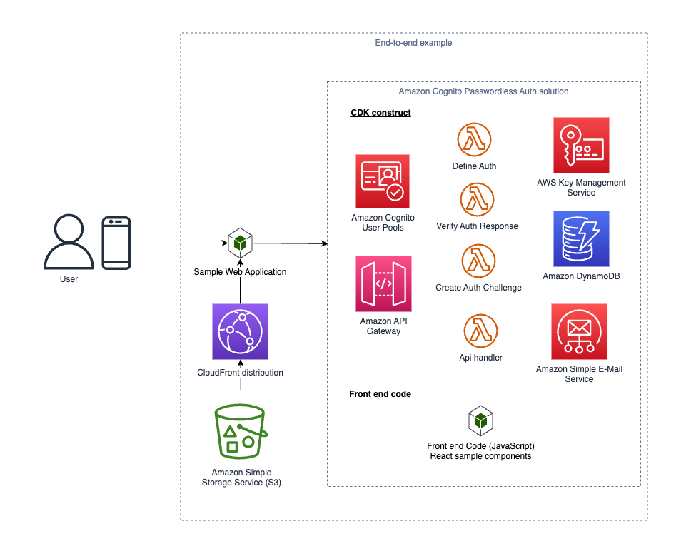

## End-to-end Example

The end-to-end example has a backend and an accompanying frontend. If you're deploying, start with the backend:

- [CDK Back End](./cdk)
- [React Front End](./client)

### What's included in the end-to-end Example?

The end-to-end example shows how to use this solution's [`Passwordless`](../cdk/lib/cognito-passwordless.ts) CDK construct, and the prebuilt [React hooks and components](../client/react/README-REACT.md), in an end-to-end example, with a sample web application that is hosted on CloudFront + S3

#### Diagram

